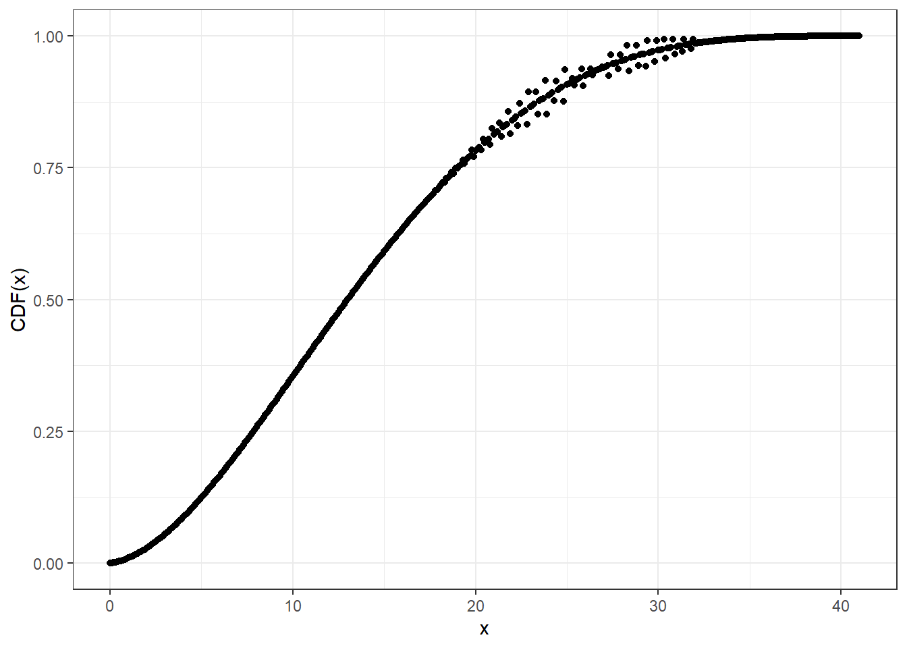
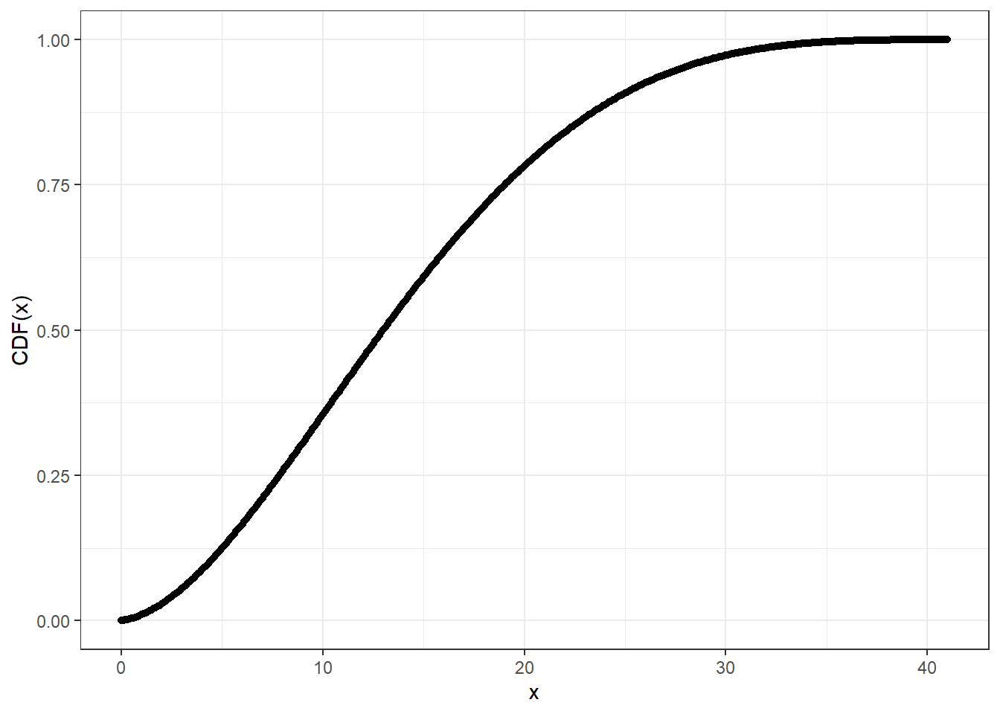
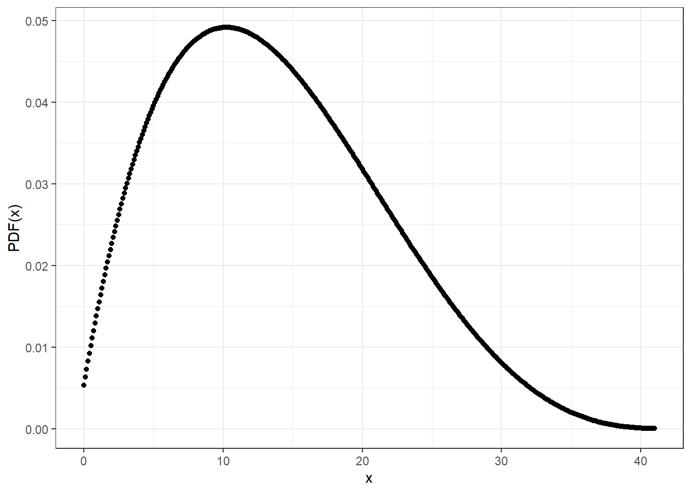

<!-- README.md is generated from README.Rmd. Please edit that file -->

# Continuous beta-binomial distribution

<!-- badges: start -->

[](https://lifecycle.r-lib.org/articles/stages.html#experimental)
[](https://CRAN.R-project.org/package=cbbinom)
[](https://github.com/zhuxr11/cbbinom/actions/workflows/R-CMD-check.yaml)
[](https://CRAN.R-project.org/package=cbbinom)
<!-- badges: end -->

**Package**: [*cbbinom*](https://github.com/zhuxr11/cbbinom)
0.1.0.9000<br /> **Author**: Xiurui Zhu<br /> **Modified**: 2024-09-11
22:59:35<br /> **Compiled**: 2024-09-11 22:59:40

The goal of `cbbinom` is to implement continuous beta-binomial
distribution.

## Installation

### System requirements

If you are building from source (e.g. not installing binaries on
Windows), you need to prepare for two system requirements:
[GMP](https://gmplib.org/) and [MPFR](https://www.mpfr.org/), to
facilitate high-precision floating point types. You may follow the
installation instructions from their websites, or try the following
commands for quick (default) installation.

- For Windows with rtools40 (or newer) installed, please run:

``` bash
pacman -Syu make pkg-config libtool gmp mpfr
```

- For macOS, please run:

``` bash
brew install gmp mpfr
```

- For linux, please build and install platform-specific libraries
  through their `configure` file, or install them using `conda`.

If you are running R from an isolated environment (e.g. `conda`), you
need to first activate the environment, and then build the system
requirements and the package in the same environment to avoid version
conflicts such as: undefined reference to `memcpy@GLIBC#.#.#`.

### The package

If the requirements are installed into their default paths (e.g. without
using the `--prefix` option), you are OK to go ahead installing the
package in R, as `pkg-config` will take care finding them.

You can install the released version of `cbbinom` from
[CRAN](https://cran.r-project.org/) with:

``` r
install.packages("cbbinom")
```

Alternatively, you can install the developmental version of `cbbinom`
from [github](https://github.com/) with:

``` r
remotes::install_github("zhuxr11/cbbinom")
```

However, if the requirements are not installed into their default paths,
you may first need to provide configuration arguments/variables to
installation paths in one of the following ways (replacing
`<my_gmp_install>` and `<my_mpfr_install>` with your paths) before
installing the package with `R CMD INSTALL` in bash:

- Set `--configure-args` in `R CMD INSTALL`:

``` bash
MY_GMP_INSTALL='<my_gmp_install>'
MY_MPFR_INSTALL='<my_mpfr_install>'
R CMD INSTALL cbbinom \
  --configure-args="\
    --with-gmp-include=${MY_GMP_INSTALL}/include \
    --with-mpfr-include=${MY_MPFR_INSTALL}/include \
    --with-gmp-lib=${MY_GMP_INSTALL}/lib \
    --with-mpfr-lib=${MY_MPFR_INSTALL}/lib\
  "
```

- Set `--configure-vars` in `R CMD INSTALL`:

``` bash
MY_GMP_INSTALL='<my_gmp_install>'
MY_MPFR_INSTALL='<my_mpfr_install>'
R CMD INSTALL cbbinom \
  --configure-vars="\
    CBBINOM_GMP_INCLUDE=${MY_GMP_INSTALL}/include \
    CBBINOM_MPFR_INCLUDE=${MY_MPFR_INSTALL}/include \
    CBBINOM_GMP_LIB=${MY_GMP_INSTALL}/lib \
    CBBINOM_MPFR_LIB=${MY_MPFR_INSTALL}/lib\
  "
```

## Introduction to continuous beta-binomial distribution

The continuous beta-binomial distribution spreads the standard
probability mass of beta-binomial distribution at `x` to an interval
`[x, x + 1]` in a continuous manner. This can be validated via the
following plot, where we can see that the cumulative distribution
function (CDF) of the continuous beta-binomial distribution at `x + 1`
equals to that of the beta-binomial distribution at `x`.

``` r
library(cbbinom)
```

``` r
# The continuous beta-binomial CDF, shift by -1
cbbinom_plot_x <- seq(-1, 10, 0.01)
cbbinom_plot_y <- pcbbinom(
  q = cbbinom_plot_x,
  size = 10,
  alpha = 2,
  beta = 4,
  ncp = -1
)
# The beta-binomial CDF
bbinom_plot_x <- seq(0L, 10L, 1L)
bbinom_plot_y <- extraDistr::pbbinom(
  q = bbinom_plot_x,
  size = 10L,
  alpha = 2,
  beta = 4
)
ggplot2::ggplot(mapping = ggplot2::aes(x = x, y = y)) +
  ggplot2::geom_bar(
    data = data.frame(
      x = bbinom_plot_x,
      y = bbinom_plot_y
    ),
    stat = "identity"
  ) +
  ggplot2::geom_point(
    data = data.frame(
      x = cbbinom_plot_x,
      y = cbbinom_plot_y
    )
  ) +
  ggplot2::scale_x_continuous(
    n.breaks = diff(range(cbbinom_plot_x))
  ) +
  ggplot2::theme_bw() +
  ggplot2::labs(y = "CDF(x)")
```


However, the central density at `x + 1/2` of the continuous
beta-binomial distribution may not equal to the corresponding
probability mass at `x`, especially around the summit and to the right
(since `alpha < beta`).

``` r
# The continuous beta-binomial CDF, shift by -1/2
cbbinom_plot_x_d <- seq(-1/2, 10 + 1/2, 0.01)
cbbinom_plot_y_d <- dcbbinom(
  x = cbbinom_plot_x_d,
  size = 10,
  alpha = 2,
  beta = 4,
  ncp = -1/2
)
# The beta-binomial CDF
bbinom_plot_x <- seq(0L, 10L, 1L)
bbinom_plot_y_d <- extraDistr::dbbinom(
  x = bbinom_plot_x,
  size = 10L,
  alpha = 2,
  beta = 4
)
ggplot2::ggplot(mapping = ggplot2::aes(x = x, y = y)) +
  ggplot2::geom_bar(
    data = data.frame(
      x = bbinom_plot_x,
      y = bbinom_plot_y_d
    ),
    stat = "identity"
  ) +
  ggplot2::geom_point(
    data = data.frame(
      x = cbbinom_plot_x_d,
      y = cbbinom_plot_y_d
    )
  ) +
  ggplot2::scale_x_continuous(
    n.breaks = diff(range(bbinom_plot_x))
  ) +
  ggplot2::theme_bw() +
  ggplot2::labs(y = "CDF(x)")
```


For larger sizes, you may need higher precision than double for
accuracy, at the cost of computational speed.

``` r
cbbinom_plot_prec_x_p <- seq(0, 41, 0.1)
# Compute CDF at default (double) precision level
system.time(pcbbinom_plot_prec0_y <- pcbbinom(
  q = cbbinom_plot_prec_x_p,
  size = 40,
  alpha = 2,
  beta = 4,
  prec = NULL
))
#>    user  system elapsed 
#>    0.06    0.00    0.07
```

``` r
ggplot2::ggplot(data = data.frame(x = cbbinom_plot_prec_x_p,
                                  y = pcbbinom_plot_prec0_y),
                mapping = ggplot2::aes(x = x, y = y)) +
  ggplot2::geom_point() +
  ggplot2::theme_bw() +
  ggplot2::labs(y = "CDF(x)")
```



``` r
# Compute CDF at precision level 20
system.time(pcbbinom_plot_prec20_y <- pcbbinom(
  q = cbbinom_plot_prec_x_p,
  size = 40,
  alpha = 2,
  beta = 4,
  prec = 20L
))
#>    user  system elapsed 
#>    3.70    0.01    3.72
```

``` r
ggplot2::ggplot(data = data.frame(x = cbbinom_plot_prec_x_p,
                                  y = pcbbinom_plot_prec20_y),
                mapping = ggplot2::aes(x = x, y = y)) +
  ggplot2::geom_point() +
  ggplot2::theme_bw() +
  ggplot2::labs(y = "CDF(x)")
```



When computing probability density, it is advisable to use a higher
accuracy level than the one sufficient to compute the corresponding
cumulative probability (e.g. 20 -\> 25), since numerical derivative
taken to compute the probability density may be more sensitive to
computational errors.

``` r
cbbinom_plot_prec_x_d <- seq(0, 41, 0.1)
# Compute PDF at precision level 20
system.time(dcbbinom_plot_prec20_y <- dcbbinom(
  x = cbbinom_plot_prec_x_d,
  size = 40,
  alpha = 2,
  beta = 4,
  prec = 20L
))
#> Warning in cpp_dcbbinom(x = as.numeric(x - ncp), size = as.numeric(size), :
#> d[pcbbinom(q = 29.000000, size = 40.000000, alpha = 2.000000, beta =
#> 4.000000)]/dq = -0.000206 < 0, which is set to 0, since probability density
#> cannot be negative; you may use a higher [prec] level than 20
#>    user  system elapsed 
#>   27.65    0.05   27.89
```

``` r
ggplot2::ggplot(data = data.frame(x = cbbinom_plot_prec_x_d,
                                  y = dcbbinom_plot_prec20_y),
                mapping = ggplot2::aes(x = x, y = y)) +
  ggplot2::geom_point() +
  ggplot2::theme_bw() +
  ggplot2::labs(y = "PDF(x)")
```



``` r
# Compute PDF at precision level 25
system.time(dcbbinom_plot_prec25_y <- dcbbinom(
  x = cbbinom_plot_prec_x_d,
  size = 40,
  alpha = 2,
  beta = 4,
  prec = 25L
))
#>    user  system elapsed 
#>   39.04    0.06   39.42
```

``` r
ggplot2::ggplot(data = data.frame(x = cbbinom_plot_prec_x_d,
                                  y = dcbbinom_plot_prec25_y),
                mapping = ggplot2::aes(x = x, y = y)) +
  ggplot2::geom_point() +
  ggplot2::theme_bw() +
  ggplot2::labs(y = "PDF(x)")
```


## Examples of continuous beta-binomial distribution

As the probability distributions in `stats` package, `cbbinom` provides
a full set of density, distribution function, quantile function and
random generation for the continuous beta-binomial distribution.

``` r
# Density function
dcbbinom(x = 5, size = 10, alpha = 2, beta = 4)
#> [1] 0.12669
```

``` r
# Distribution function
(test_val <- pcbbinom(q = 5, size = 10, alpha = 2, beta = 4))
#> [1] 0.7062937
```

``` r
# Quantile function
qcbbinom(p = test_val, size = 10, alpha = 2, beta = 4)
#> [1] 5
```

``` r
# Random generation
set.seed(1111L)
rcbbinom(n = 10L, size = 10, alpha = 2, beta = 4)
#>  [1] 3.359039 3.038286 7.110936 1.311321 5.264688 8.709005 6.720415 1.164210
#>  [9] 3.868370 1.332590
```

These functions are also available in `Rcpp` as
`cbbinom::cpp_*cbbinom()`, when using `[[Rcpp::depends(cbbinom)]]` and
`#include <cbbinom.h>`.

For mathematical details, please check the details section of
`?cbbinom`.

## High-precision generalized hypergeometric function

The computation of the continuous beta-binomial CDF relies on
high-precision generalized hypergeometric function.

According to [Matlab Online](https://matlab.mathworks.com/), the
generalized hypergeometric function underlying
`cbbinom::pcbbinom(q = 29.2, size = 40, alpha = 2, beta = 4)` is
evaluated as:

    >> hypergeom([1-29.2 40+1-29.2 40+1-29.2+4], [40+2-29.2 40+1-29.2+2+4], 1)

    ans =

       2.7120e-09

Currently, package
[`hypergeo`](https://cran.r-project.org/package=hypergeo) offers a
function `genhypergeo()` but it lacks precision in some cases.

``` r
hypergeo_q <- 29.2
hypergeo_size <- 40
hypergeo_alpha <- 2
hypergeo_beta <- 4
hypergeo_U <- c(1 - hypergeo_q,
                hypergeo_size + 1 - hypergeo_q,
                hypergeo_size + 1 - hypergeo_q + hypergeo_beta)
hypergeo_L <- c(hypergeo_size + 2 - hypergeo_q,
                hypergeo_size + 1 - hypergeo_q + hypergeo_alpha + hypergeo_beta)
hypergeo_x <- 1
hypergeo::genhypergeo(U = hypergeo_U, L = hypergeo_L, z = hypergeo_x)
#> [1] 3.419707e-09
```

This results in a cumulative distribution value greater than 1:

``` r
gamma(hypergeo_size + 1) *
  beta(hypergeo_size + 1 - hypergeo_q + hypergeo_beta, hypergeo_alpha) /
  gamma(hypergeo_q) /
  gamma(hypergeo_size + 2 - hypergeo_q) /
  beta(hypergeo_alpha, hypergeo_beta) *
  hypergeo::genhypergeo(U = hypergeo_U, L = hypergeo_L, z = hypergeo_x)
#> [1] 1.218006
```

When computing with double precision, the implementation in `cbbinom`
also lacks precision, although much better compared with
`hypergeo::genhypergeo()`:

``` r
cbbinom::gen_hypergeo(U = hypergeo_U, L = hypergeo_L, x = hypergeo_x,
                      prec = NULL, check_mode = TRUE, log = FALSE)
#> [1] 2.781375e-09
```

However, when computing with `mpfr` floating-point datatype with a
precision of 20 digits, the implementation in `cbbinom` gives a precise
answer:

``` r
cbbinom::gen_hypergeo(U = hypergeo_U, L = hypergeo_L, x = hypergeo_x,
                      prec = 20L, check_mode = TRUE, log = FALSE)
#> [1] 2.712035e-09
```

This functions is also available in `Rcpp` as `cbbinom::gen_hypergeo()`,
when using `[[Rcpp::depends(cbbinom)]]` and `#include <cbbinom.h>`.

In conclusion, the use of `mpfr` floating-point datatype facilitates
precise computation of generalized hypergeometric functions, thus giving
precise results from the continuous beta-binomial functions.

## `Rcpp` implementation of `stats::uniroot()`

As a bonus, `cbbinom` also exports an `Rcpp` implementation of
`stats::uniroot()` function, which may come in handy to solve equations,
especially the monotonic ones used in quantile functions. Here is an
example to calculate `qnorm` from `pnorm` in `Rcpp`.

``` cpp
#include <iostream>
#include "cbbinom.h"
using namespace cbbinom;

// Define a functor as pnorm() - p
class PnormEqn: public UnirootEqn
{
private:
  double mu;
  double sd;
  double p;
public:
  PnormEqn(const double mu_, const double sd_, const double p_):
    mu(mu_), sd(sd_), p(p_) {}
  double operator () (const double& x) const override {
    return R::pnorm(x, this->mu, this->sd, true, false) - this->p;
  }
};

// Compute quantiles
int main() {
  double p = 0.975;  // Quantile
  PnormEqn eqn_obj(0.0, 1.0, 0.975);
  double tol = 1e-6;
  int max_iter = 10000;
  double q = cbbinom::cpp_uniroot(-1000.0, 1000.0, -p, 1.0 - p, &eqn_obj, &tol, &max_iter);
  std::cout << "Quantile at " << p << "is: " << q << std::endl;
  return 0;
}
```
