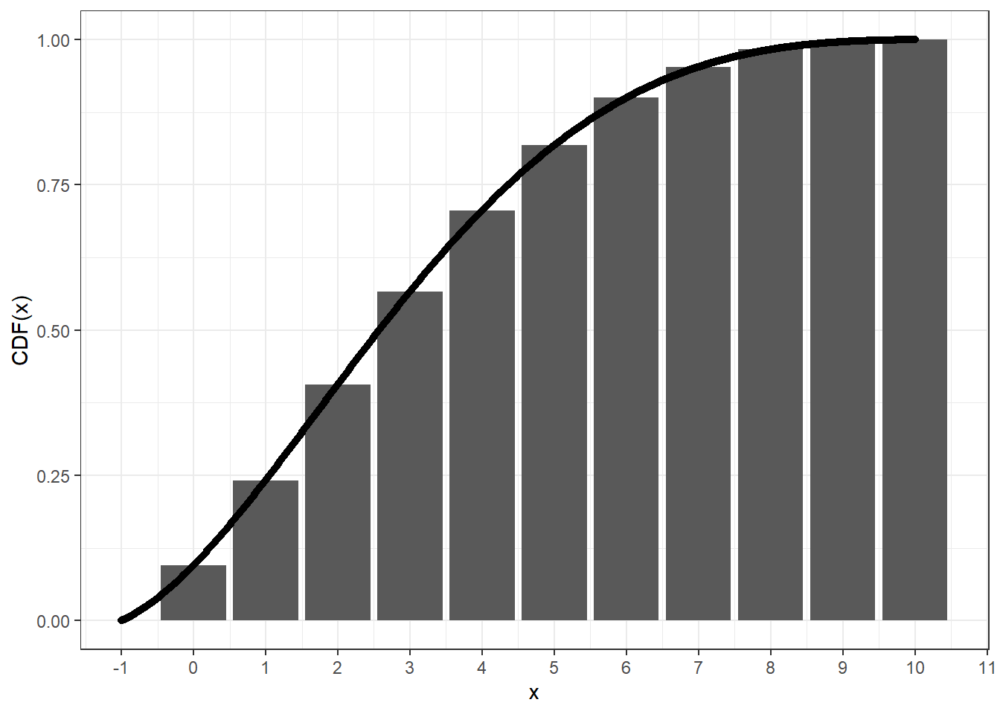

<!-- README.md is generated from README.Rmd. Please edit that file -->

# Continuous beta-binomial distribution

<!-- badges: start -->

[](https://lifecycle.r-lib.org/articles/stages.html#experimental)
[](https://CRAN.R-project.org/package=cbbinom)
[](https://github.com/zhuxr11/cbbinom/actions)
[](https://CRAN.R-project.org/package=cbbinom)
<!-- badges: end -->

**Package**: [*cbbinom*](https://github.com/zhuxr11/cbbinom)
0.0.0.9000<br /> **Author**: Xiurui Zhu<br /> **Modified**: 2024-08-26
00:05:17<br /> **Compiled**: 2024-08-26 00:05:23

The goal of `cbbinom` is to implement continuous beta-binomial
distribution.

## Installation

You can install the released version of `cbbinom` from
[CRAN](https://cran.r-project.org/) with:

``` r
install.packages("cbbinom")
```

Alternatively, you can install the developmental version of `cbbinom`
from [github](https://github.com/) with:

``` r
remotes::install_github("zhuxr11/cbbinom")
```

## Examples of continuous beta-binomial distribution

The continuous beta-binomial distribution spreads the standard
probability mass of beta-binomial distribution at `x` to an interval
`[x, x + 1]` in a continuous manner. This can be validated via the
following plot, where we can see that the cumulative distribution
function (CDF) of the continuous beta-binomial distribution at `x + 1`
equals to that of the beta-binomial distribution at `x`.

``` r
library(cbbinom)
```

``` r
cbbinom_plot_x <- seq(-1, 10, 0.01)
cbbinom_plot_y <- pcbbinom(
  q = cbbinom_plot_x,
  size = 10L,
  alpha = 2,
  beta = 4,
  ncp = -1
)
bbinom_plot_x <- seq(0L, 10L, 1L)
bbinom_plot_y <- extraDistr::pbbinom(
  q = bbinom_plot_x,
  size = 10L,
  alpha = 2,
  beta = 4
)
ggplot2::ggplot(mapping = ggplot2::aes(x = x, y = y)) +
  # The beta-binomial CDF
  ggplot2::geom_bar(
    data = data.frame(
      x = bbinom_plot_x,
      y = bbinom_plot_y
    ),
    stat = "identity"
  ) +
  # The continuous beta-binomial CDF, shift by -1
  ggplot2::geom_point(
    data = data.frame(
      x = cbbinom_plot_x,
      y = cbbinom_plot_y
    )
  ) +
  ggplot2::scale_x_continuous(
    n.breaks = diff(range(cbbinom_plot_x))
  ) +
  ggplot2::theme_bw() +
  ggplot2::labs(y = "CDF(x)")
```



As the probability distributions in `stats` package, `cbbinom` provides
a full set of density, distribution function, quantile function and
random generation for the continuous beta-binomial distribution.

``` r
# Density function
dcbbinom(x = 5, size = 10, alpha = 2, beta = 4)
#> [1] 0.4761784
```

``` r
# Distribution function
(test_val <- pcbbinom(q = 5, size = 10, alpha = 2, beta = 4))
#> [1] 0.7062937
```

``` r
# Quantile function
qcbbinom(p = test_val, size = 10, alpha = 2, beta = 4)
#> [1] 5
```

``` r
# Random generation
set.seed(1111L)
rcbbinom(n = 10L, size = 10, alpha = 2, beta = 4)
#>  [1] 3.358800 3.038155 7.110413 1.311272 5.264337 8.709327 6.721018 1.164173
#>  [9] 3.868141 1.332541
```

For mathematical details, please check the details section of
`?cbbinom`.

## `Rcpp` implementation of `stats::uniroot()`

As a bonus, `cbbinom` also exports an `Rcpp` implementation of
`stats::uniroot()` function, which may come in handy to solve equations,
especially the monotonic ones used in quantile functions. Here is an
example to calculate `qnorm` from `pnorm` in `Rcpp`.

``` cpp
#include <iostream>
#include "cbbinom.h"
using namespace cbbinom;

// Define a functor as pnorm() - p
class PnormEqn: public UnirootEqn
{
private:
  double mu;
  double sd;
  double p;
public:
  PnormEqn(const double mu_, const double sd_, const double p_):
    mu(mu_), sd(sd_), p(p_) {}
  double operator () (const double& x) const override {
    return R::pnorm(x, this->mu, this->sd, true, false) - this->p;
  }
};

// Compute quantiles
int main() {
  double p = 0.975;  // Quantile
  PnormEqn eqn_obj(0.0, 1.0, 0.975);
  double tol = 1e-6;
  int max_iter = 10000;
  double q = cbbinom::cpp_uniroot(-1000.0, 1000.0, -p, 1.0 - p, &eqn_obj, &tol, &max_iter);
  std::cout << "Quantile at " << p << "is: " << q << std::endl;
  return 0;
}
```
